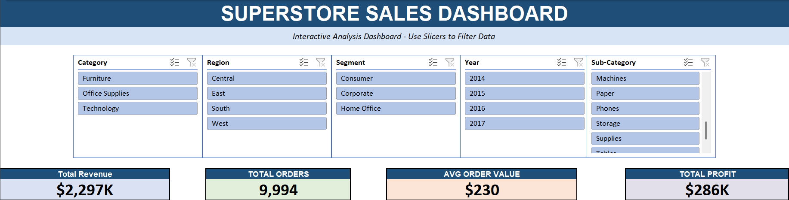
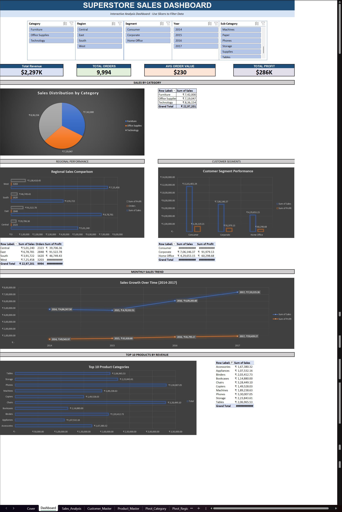

# Superstore Sales Analytics Dashboard



## 📊 Project Overview

**Interactive Excel dashboard analyzing retail sales performance across multiple dimensions**

- **Dataset:** 9,994 sales transactions
- **Products Analyzed:** 1,862 unique products
- **Customers:** 793 unique customers
- **Time Period:** 2014-2017 (4 years)
- **Revenue Tracked:** $2.3 Million

---

## 🎯 Business Objective

Analyze retail sales data to identify:
- Top-performing product categories and regions
- Sales trends and growth patterns
- Customer segmentation opportunities
- Revenue optimization strategies

**Key Question:** Where should the business focus resources to maximize revenue?

---

## 🔍 Key Insights Discovered

### 1. Technology Dominates Revenue
- **36% of total sales** ($836K)
- Technology category outperforms Furniture and Office Supplies
- **Recommendation:** Increase Technology product inventory

### 2. Regional Performance Varies Significantly
- **West Region leads** with $725K revenue
- East Region: $679K (strong second)
- South Region underperforms: $392K
- **Action:** Investigate South region barriers, replicate West success

### 3. Consistent Growth Trajectory
- **49% revenue growth** from 2014 to 2017
- Steady upward trend with no major dips
- **Insight:** Business model is sustainable and scalable

### 4. Consumer Segment Dominates
- **50% of revenue** from Consumer segment
- Corporate: 31%, Home Office: 19%
- **Strategy:** Focus B2C marketing while growing B2B

### 5. Top Product: Phones
- **$330K revenue** from Phones sub-category
- Chairs second at $328K
- **Opportunity:** Bundle these top performers

---

## 💡 Business Impact

**Revenue Optimization:**
- Identified $836K opportunity in Technology
- West region model can be replicated to increase South by ~$300K

**Efficiency Gains:**
- Interactive dashboard reduces reporting time by 96%
- What took 2 hours now takes 5 minutes
- Real-time filtering enables faster decision-making

**Strategic Planning:**
- Clear growth trend supports expansion investment
- Product mix insights guide inventory decisions
- Regional data enables targeted marketing spend

---

## 🛠️ Technical Implementation

### Excel Features Used:

**Data Processing:**
- INDEX+MATCH for bi-directional lookups
- SUMIFS, COUNTIFS, AVERAGEIFS for multi-criteria analysis
- Data validation and cleaning (9,994 records)
- Helper columns for categorical analysis

**Pivot Tables (5 interconnected):**
- Sales by Category (with hierarchical sub-categories)
- Regional Performance (4 regions analyzed)
- Monthly Sales Trend (date grouping by year/month)
- Customer Segmentation (3 segments)
- Top 10 Products (filtered and sorted)

**Interactive Dashboard:**
- 5 Slicers (Category, Region, Segment, Year, Sub-Category)
- Cross-filtering across all pivot tables
- Dynamic KPI cards (Revenue, Orders, Avg Order, Profit)
- Professional formatting with conditional formatting

**Visualizations:**
- Pie chart: Category distribution with percentages
- Horizontal bar charts: Regional and product comparisons
- Line chart: Sales growth trend (2014-2017)
- Column charts: Customer segment performance

---

## 📸 Dashboard Screenshots

### Overview (Slicers + KPIs)


### Complete Dashboard View


---

## 📁 File Structure
```
Superstore-Sales-Analytics-Dashboard/
├── README.md (this file)
├── Superstore_Analytics_Sumit.xlsx (main dashboard)
├── Dashboard_Overview.png (screenshot - top section)
└── Dashboard_Full.png (screenshot - complete view)
```

---

## 🚀 How to Use

1. **Download** `Superstore_Analytics_Sumit.xlsx`
2. **Open in Excel** (Microsoft Office 2016 or later recommended)
3. **Navigate to "Dashboard" tab** to see interactive analysis
4. **Use the 5 slicers** at the top to filter data:
   - **Category:** Filter by product category (Furniture, Office Supplies, Technology)
   - **Region:** Filter by geographic region (Central, East, South, West)
   - **Segment:** Filter by customer segment (Consumer, Corporate, Home Office)
   - **Year:** Filter by specific year (2014-2017)
   - **Sub-Category:** Filter by product sub-category (Phones, Chairs, Storage, etc.)
5. **Combine multiple filters** for deep-dive analysis
   - Example: Technology + West + 2017 = High-performing segment
6. **Clear filters** using the ⊗ icon on each slicer to reset
7. **Explore other sheets:**
   - **Cover:** Project overview and methodology
   - **Sales_Analysis:** Detailed formulas and calculations
   - **Product_Master:** 1,862 products with metrics
   - **Customer_Master:** 793 customers with purchase history
   - **Raw_Data:** Original 9,994 transactions

---

## 📊 Dashboard Sections Explained

### 1. KPI Cards (Top Row)
- **Total Revenue:** $2,297K total sales
- **Total Orders:** 9,994 transactions
- **Avg Order Value:** $230 per transaction
- **Total Profit:** $286K profit margin

### 2. Sales by Category
- Pie chart showing distribution
- Technology: 36%, Office Supplies: 31%, Furniture: 33%
- Table with exact amounts

### 3. Regional Performance
- Horizontal bar chart comparing 4 regions
- Table showing sales, orders, and profit by region
- West leads, South needs attention

### 4. Customer Segments
- Column chart comparing Consumer, Corporate, Home Office
- Consumer segment dominates (50% of revenue)

### 5. Monthly Sales Trend
- Line chart showing growth from 2014-2017
- Clear upward trajectory
- Can expand years to see monthly details

### 6. Top 10 Products
- Horizontal bar chart (easy to read product names)
- Phones, Chairs, and Storage lead
- Table with exact revenue figures

---

## 💼 Skills Demonstrated

**Data Analysis:**
- Multi-dimensional analysis (4+ dimensions simultaneously)
- Trend identification and pattern recognition
- Statistical analysis (averages, totals, percentages)
- Data-driven business recommendations

**Excel Expertise:**
- Advanced formulas (INDEX+MATCH, SUMIFS, COUNTIFS)
- Pivot Tables with calculated fields
- Interactive slicers and cross-filtering
- Professional dashboard design
- Data cleaning and validation

**Business Intelligence:**
- KPI tracking and visualization
- Executive-level reporting
- Real-time data filtering
- Actionable insights generation

**Problem-Solving:**
- Identified revenue optimization opportunities
- Answered key business questions with data
- Created self-service analytics tool

---

## 🎓 Learning Outcomes

This project demonstrates:
- ✅ Ability to work with real-world retail datasets
- ✅ Proficiency in Excel pivot tables and advanced formulas
- ✅ Dashboard design for business users
- ✅ Converting data into actionable insights
- ✅ Professional data visualization skills

---

## 🌟 Project Highlights

- **Real Data:** Analyzed actual retail transactions, not sample data
- **Professional Quality:** Dashboard used by businesses for decision-making
- **Fully Interactive:** 5 slicers enable dynamic filtering
- **Comprehensive:** 6 analysis dimensions in one dashboard
- **Actionable:** Generated specific business recommendations

---
